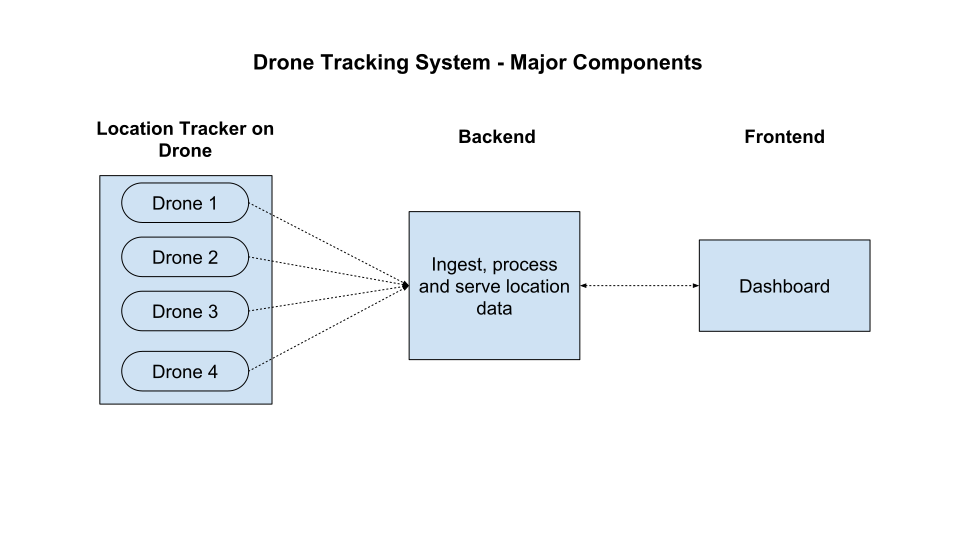

# Objective

To build a system that provides real-time location data for a fleet of drones

## Requirements and Constraints

In a real scenario, a few rounds of interview with the customer would help flesh out the requirements in detail. The following questions can be used to illuminate the requirements for the location tracking system

| Question | Rationale |
| -- | -- |
| What is the use case for the drones? | This will drive other requirements |
| Why are we tracking drones? | To understand how critical location data is (eg. for information and record keeping or to retrieve in events of failure (Locate a drone if it crashes or is lost)) |
| How important is it to have the location data? | To decide the reliability of communication and fallbacks |
| What is the resolution of location that is expected? | This will affect the size of data packets being transmitted |
| What is the frequency of update of the location expected? | This will affect the bandwidth and power requirements of the drone |
| What level of security is expected during data exchange? | This will affect the protocol chosen for communication between drone and backend |
| What are the number of drones expected to be tracked? | To decide the scale that the backend should be able to handle |
| What other data is being transmitted by the drones? | This will affect the available bandwidth for sending the location data |

Considering this is a mock assignment, I have used the information provided in the problem statement and various assumptions to resolve the above queries and build the location tracking system

| Assumptions | Reference |
| -- | -- |
| Number of users | Single user |
| Number of Drones | **XX** |
| Communication network used by drones | Cellular network |

Based on the requirements defined in the problem statement the objective is to build a location tracking system that 
1. Tracks the location of drones in real-time
2. Only displays the last location of the drones
3. Uses as little data as possible to communicate position from the drones

Using the above requirements and guidelines I setup the major components of the drone-location-tracker and their responsibilities

## Drone Tracking System - Major components

There are three main components as provided in the diagram

1. Location Tracker on Drone - This component is responsible for using the APIs on the drone to fetch position data and send them to the backend

2. Backend - This component is responsible for ingesting, storing, processing and serving location data received from the drones
   
3. Dashboard - This is the frontend for the location tracking system to display real time data for the drones

Next I took up each component at a time, fleshed out their respective requirements and operating constraints and their responsibilities