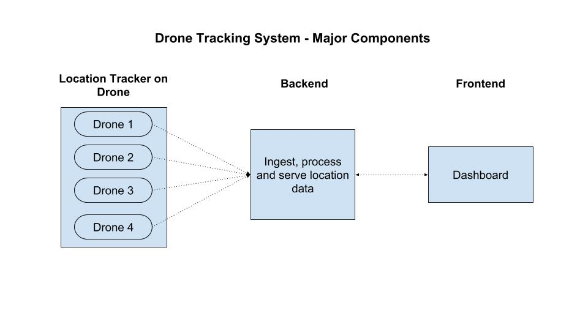

## Table of Contents

- [Objective](#objective)
- [Requirements and Constraints](#requirements-and-constraints)
- [Assumptions](#assumptions)
- [Drone Tracking System - Major components](#drone-tracking-system---major-components)

## Objective

To build a system that provides real-time location data for a fleet of drones

## Requirements and Constraints

In a real scenario, a few rounds of interview with the customer would help flesh out the requirements in detail. The following questions can be used to illuminate the requirements for the location tracking system

| Question | Rationale |
| -- | -- |
| What is the use case for the drones? | The use case of drones will determine a host of other requirements - security, reliability, speed of communication etc. Use of drones for military versus use of drones for agriculutral land surveying will have vastly different requirements |
| What is the primary purpose of the drones? | This will determine the resources available for the location tracking service on the drone.     Consider a drone that scans, processes and sends high resolution images. In such a scenario, the location tracking system on the drone should use minimal resources to allow processing power, bandwidth etc for the primary functionality |
| Why are we tracking drones? | To understand how to deal with location data received from the drones (eg. for information and record keeping or to retrieve in events of failure (Locate a drone if it crashes or is lost)). This will help to decide if we   - Should prioritize speed over reliability of communication from drones?   - Should be concerned with storing past location data? |
| What are the security requirements during data exchange between the drone and the system's backend? | This will affect the protocol chosen for communication between drone and backend |
| # |  |
| What are the number of drones expected to be tracked? | To decide the scale (number of messages per second) that the backend should be able to handle |
| What is the resolution of location that is expected? | This will be a function of why we are tracking drones. This is relevant as   - It will affect the size of data packets being transmitted    - This will affect the power consumption on the drone - fetching higher resolution geolocation data would be more power intensive  |
| What is the frequency of update of the location expected? | This will affect the bandwidth and power requirements of the drone |
| # |  |
| What is the budget and the timeline for the project | The budget and timeline will together determine the scope of the project (features and functionality) |

## Assumptions

Considering this is a mock assignment, I have used the information provided in the problem statement and various assumptions to answer the above queries and decide between trade-offs to build the location tracking system

| Assumptions | Reference from problem statement used as basis |
| -- | -- |
| Number of users | Single user (A company) |
| Number of Drones | **XX** |
| Communication network used by drones | Cellular network   - Drones flying around the country |
| Prioritize speed of communication over reliability | - Tracks the location of drones in real-time   - Only displays the last location of the drones |
| Use minimal data for communicating position | Use as little data as possible to communicate position from the drones |
| Security* |  |

*For this assignment security risks have been identified and documented. The mitigation for the vulnerabilities has not been implemented.

Using the above requirements and guidelines I setup the major components of the drone-location-tracker and their responsibilities

## Drone Tracking System - Major components

There are three main components as provided in the diagram

1. Location Tracker on Drone - This component is responsible for using the APIs on the drone to fetch position data and send them to the backend

2. Backend - This component is responsible for ingesting, storing, processing and serving location data received from the drones
   
3. Dashboard - This is the frontend for the location tracking system to display real time data for the drones

Next I took up each component, one at a time, fleshed out their requirements and operating constraints and designed their sub-components