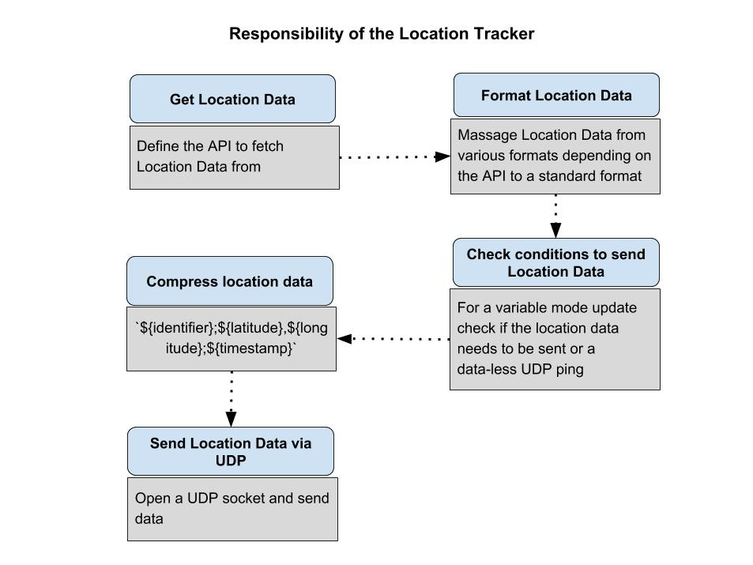

## Table of Contents

- [LocationTracker](#locationtracker)
    - [Operating environment constraints](#operating-environment-constraints)
    - [Key decisions to be made based on the constraints and requirements](#key-decisions-to-be-made-based-on-the-constraints-and-requirements)
    - [Assumptions](#assumptions)
    - [Code Design and Implementation](#code-design-and-implementation)
- [API Documentation](#api-documentation)
    - [LocationTracker](#locationtracker)
        - [new LocationTracker(id, updateInterval, mode, UDP_PORT, UDP_HOST)](#new-locationtrackerid-updateinterval-mode-udp_port-udp_host)
        - [locationTracker.startTracking()](#locationtrackerstarttracking)
        - [locationTracker.pauseTracking()](#locationtrackerpausetracking)
        - [locationTracker.getPosition() ⇒ <code>Promise</code> ℗](#locationtrackergetposition--codepromisecode-)
        - [locationTracker.isOnline() ⇒ <code>Promise</code> ℗](#locationtrackerisonline--codepromisecode-)
        - [locationTracker.canSendLocation() ⇒ <code>Boolean</code> ℗](#locationtrackercansendlocation--codebooleancode-)
        - [locationTracker.formatPosition(position) ⇒ <code>Object</code> ℗](#locationtrackerformatpositionposition--codeobjectcode-)
        - [locationTracker.compressPosition(position) ⇒ <code>String</code> ℗](#locationtrackercompresspositionposition--codestringcode-)
        - [locationTracker.sendLocation() ℗](#locationtrackersendlocation-)
        - [locationTracker.sendMessage(message) ℗](#locationtrackersendmessagemessage-)

# LocationTracker

## Operating environment constraints

The design of the location tracker will have to account for the following constraints arising from the operating environment while providing real-time location with as little data as possible

1. Battery power
2. Connectivity
   - Bandwidth
   - Costs
   - Quality of connectivity 
3. Processing power
   - Interference with Drone’s other processes

## Key decisions to be made based on the constraints and requirements
Based on the operating environment constraints and requirements the selection of the following components will be crucial

1. Protocol to communicate between the drone and the backend - The selection of protocol will determine
    1. Reliability of the communication
    2. Speed of the communication
    3. Size of data packet that is sent
    4. Consumption of drone's network bandwidth

2. What data should be sent from the drone to the backend - Since the objective is to minimize the quantum of data sent, selecting the most relevant data fields becomes important. The following data fields can be sent from the drone
    1. Drone Identifier
    2. Timestamp
    3. Position Data
        1. Latitude
        2. Longitude
        3. Altitude
    4. Accuracy in Latitude and Longitude
    5. Accuracy in Altitude
    6. Direction of movement
    7. Speed

3. Frequency of update - As minimizing the quantum of data transferred is a requirement, the frequency of update becomes key. The update for position can be gathered in two modes 
    1. Continuous mode - Where the drone sends data each time its position changes
    2. Variable mode - Where the drone updates on its position after a set interval
   
   In the variable mode, one can define additional rules when sending position data. For instance
   - If the drone is stationary it could send back an empty ping
   - If the change in the position of the drone is less than the accuracy of the measurement, it could send back an empty ping

4. Format of data - The format in which data is communicated between the drone and the backend can also be optimized. For instance a format such as XML would be more data intensive than JSON.

5. Resolution of Location data - The resolution of data would be decided based on the precision requirements of the user. The resolution of location data will affect
    1. Consumption of battery power on the drone - More precise location would require more intensive processing on the drone and thus consume more power
    2. Size of the data packet sent - More precise location would also increase the bytes of data sent by the drone

6. Processing of location data on the drone - Considering the other functionality of the drone (for instance sending real-time video) will affect the processing power that can be used on the drone to ensure that it does not interfere with the main functionality of the drone

## Assumptions

| Component | Remarks |
| -- | -- |
| Protocol | UDP |
| Data to be sent from the drone | - Latitude   - Longitude   - Timestamp |
| Frequency of update | - Variable mode   - Update Interval - 1s |
| Format of data | `${identifier};${latitude},${longitude};${timestamp}` |
| Resolution of location data | 6 Decimal degrees (Precision of ~ 100mm ) |

Rationale for selecting the UDP protocol for communication between the drone and the backend

1. Since the objective of the system is to display real-time data, the speed of data transfer has been prioritized over the reliability
   - UDP is a connectionless protocol while TCP which is a connection based protocol. TCP requires a three way handshake to establish a connection before sending packets. 
   - TCP provides error checking which UDP does not

   For the above reasons UDP provides a better speed of communication than TCP

2. Another requirement from the system is to communicate by transmitting the minimal amount of data
   - On the Transport Layer - Size of the TCP header is 20 bytes while the size of the UDP header is 8 bytes
   - TCP protocol sends acknowledgements for each packet of data received. This also increases the consumption of network bandwidth.
   - Application level protocols such as HTTP have not been used because data encapsulation from these protocols would further increase the quantum of data sent in each request

## Code Design and Implementation

The core responsibilities of the location tracker code on the drone are

# API Documentation

## LocationTracker
**Kind**: global class  

* [LocationTracker](#LocationTracker)
    * [new LocationTracker(id, updateInterval, mode, UDP_PORT, UDP_HOST)](#new_LocationTracker_new)
    * [.startTracking()](#LocationTracker+startTracking)
    * [.pauseTracking()](#LocationTracker+pauseTracking)
    * [.getPosition()](#LocationTracker+getPosition) ⇒ <code>Promise</code> ℗
    * [.isOnline()](#LocationTracker+isOnline) ⇒ <code>Promise</code> ℗
    * [.canSendLocation()](#LocationTracker+canSendLocation) ⇒ <code>Boolean</code> ℗
    * [.formatPosition(position)](#LocationTracker+formatPosition) ⇒ <code>Object</code> ℗
    * [.compressPosition(position)](#LocationTracker+compressPosition) ⇒ <code>String</code> ℗
    * [.sendLocation()](#LocationTracker+sendLocation) ℗
    * [.sendMessage(message)](#LocationTracker+sendMessage) ℗

### new LocationTracker(id, updateInterval, mode, UDP_PORT, UDP_HOST)
Create a LocationTracker instance

| Param | Type | Description |
| --- | --- | --- |
| id | <code>String</code> | Unique identifier for the location tracker instance |
| updateInterval | <code>number</code> | Interval in seconds at which to provide position updates |
| mode | <code>string</code> | Specify mode for position updates - 'CONTINUOUS' or 'VARIABLE' |
| UDP_PORT | <code>number</code> | Port at which to send the position update |
| UDP_HOST | <code>String</code> | Host at which to send the position update |

### locationTracker.startTracking()
This method initializes position tracking. It uses the tracking mode defined when
creating the LocationTracker instance

**Kind**: instance method of [<code>LocationTracker</code>](#LocationTracker)  
**Access**: public  

### locationTracker.pauseTracking()
This method is used to pause location tracking for the drone. 
It closes the UDP socket opened for communicating with the backend

**Kind**: instance method of [<code>LocationTracker</code>](#LocationTracker)  
**Access**: public  

### locationTracker.getPosition() ⇒ <code>Promise</code> ℗
The following method accesses the API method GetPosition to fetch location data for the drone

**Kind**: instance method of [<code>LocationTracker</code>](#LocationTracker)  
**Returns**: <code>Promise</code> - Promise object represents the location data for the drone  
**Access**: private  

### locationTracker.isOnline() ⇒ <code>Promise</code> ℗
To following method accesses the API method isOnline to fetch network status

**Kind**: instance method of [<code>LocationTracker</code>](#LocationTracker)  
**Returns**: <code>Promise</code> - Promise object represents the network status for the drone  
**Access**: private  

### locationTracker.canSendLocation() ⇒ <code>Boolean</code> ℗
This method defines the various conditions to satisfy before sending location data. For
instance if the drone has moved less than a metre, an empty UDP packet can be sent.
This will help to reduce data transmitted. Such rules can be defined and checked using
this method

**Kind**: instance method of [<code>LocationTracker</code>](#LocationTracker)  
**Access**: private  

### locationTracker.formatPosition(position) ⇒ <code>Object</code> ℗
The following method is to sanitize position data received from the positionAPI.
This method will transform the position data to a standard format for use across
the different methods of location-tracker instance

**Kind**: instance method of [<code>LocationTracker</code>](#LocationTracker)  
**Returns**: <code>Object</code> - Returns the position object  
**Access**: private  

| Param | Type | Description |
| --- | --- | --- |
| position | <code>Object</code> | Location data of the drone |
| position.latitude | <code>string</code> | Latitude in decimal degrees |
| position.longitude | <code>string</code> | Longitude in decimal degrees |
| position.timestamp | <code>number</code> | Unix timestamp |

### locationTracker.compressPosition(position) ⇒ <code>String</code> ℗
Stores location and timestamp as a string separated by comma and semicolon
This reduces the size of data (vs sending JSON) transmitted over network

**Kind**: instance method of [<code>LocationTracker</code>](#LocationTracker)  
**Returns**: <code>String</code> - String using comma and semicolon separators to store location and timestamp  
**Access**: private  

| Param | Type | Description |
| --- | --- | --- |
| position | <code>Object</code> | Location data of the drone |
| position.latitude | <code>string</code> |  |
| position.longitude | <code>string</code> |  |
| position.timestamp | <code>number</code> | Unix timestamp |

### locationTracker.sendLocation() ℗
This method is invoked after each update interval. It invokes various methods to fetch
position data, verify if the position can be sent and sends the position data accordingly

**Kind**: instance method of [<code>LocationTracker</code>](#LocationTracker)  
**Access**: private  

### locationTracker.sendMessage(message) ℗
This method opens a UDP socket and sends location data to the backend

**Kind**: instance method of [<code>LocationTracker</code>](#LocationTracker)  
**Access**: private  

| Param | Type | Description |
| --- | --- | --- |
| message | <code>Buffer</code> | Location data appended with DroneID |
